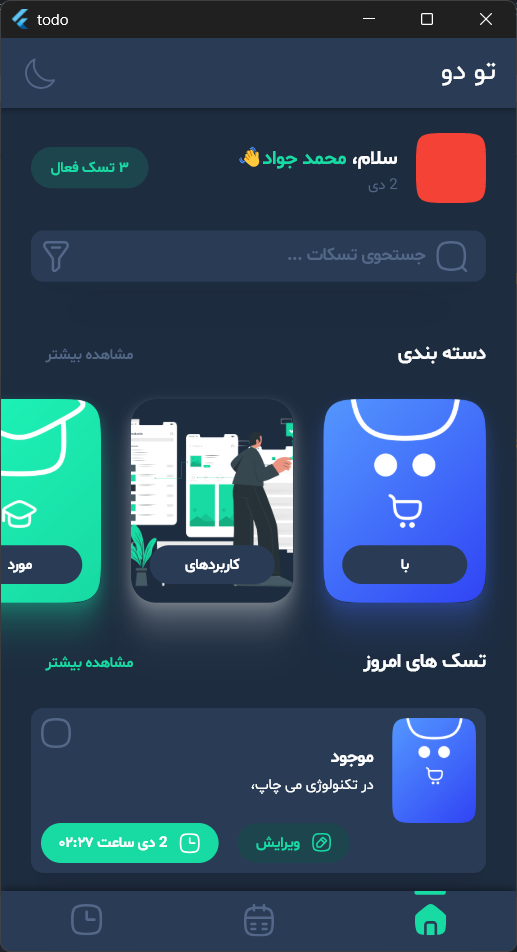
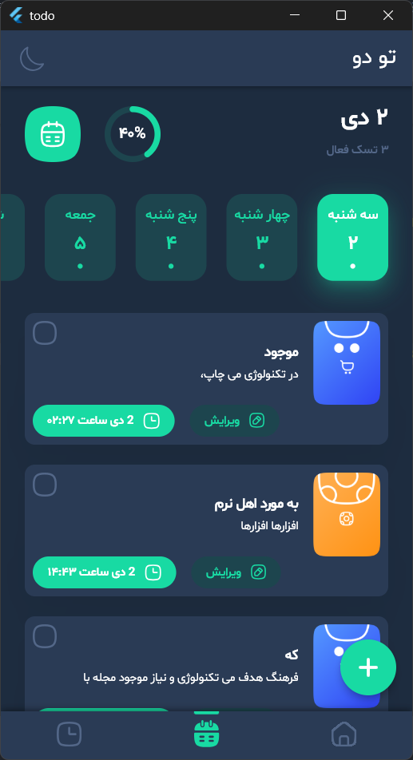
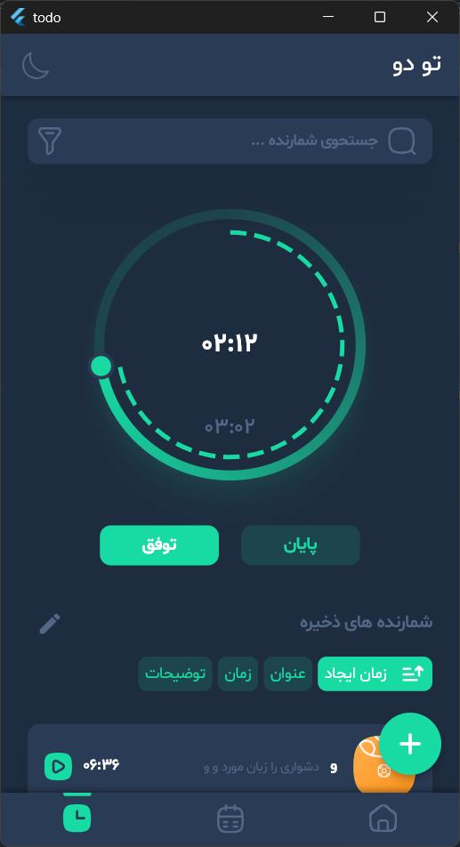
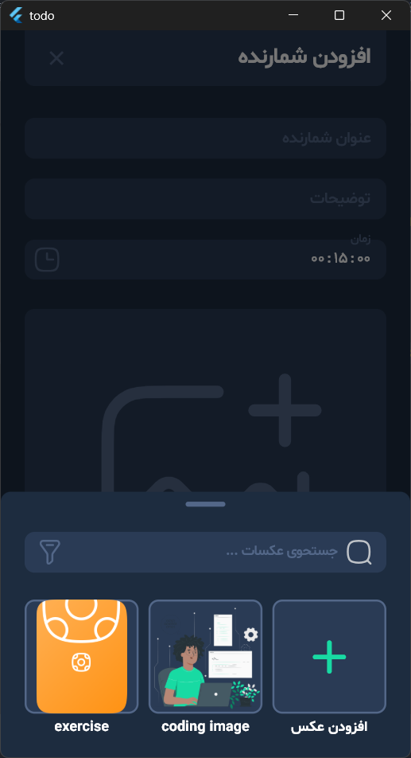

# 🚀 Overview
A simple, clean, and fast TODO application built with Flutter.
This project demonstrates best practices in state management, architecture, and UI design while keeping the codebase easy to understand and extend.

This app is designed specifically for mobile devices (Android/iOS).
The UI is optimized for small screens and is not intended for tablets or desktop layouts.

# 🧩 Feature Highlights
- Category – Create, edit, and manage categories with colors and icons
- Task – Add tasks, list tasks, and manage task state
- Counter – Add counters, list them, and run countdown timers
- Custom Color – Create and manage user-defined colors
- Image – Select, add, and manage images
- Listable – Shared list behaviors (filtering, sorting, searching, selecting)
- Screen Manager – Centralized navigation and screen state
- Home – Entry point and dashboard


# 📸 Screenshot
## Home Screen


## Task List Screen


## Counter List Screen


## Add Counter Screen



# 🧱 Architecture
```
lib/
├── constants/
├── di/
├── features/
│   ├── category/
│   │   ├── category_add/
│   │   ├── datasource/
│   │   ├── models/
│   │   ├── repository/
│   │   └── widgets/
│   ├── counter/
│   │   ├── counter_add/
│   │   ├── counter_list/
│   │   ├── datasource/
│   │   ├── models/
│   │   └── repository/
│   ├── custom_color/
│   │   ├── custom_color_add/
│   │   ├── datasource/
│   │   ├── models/
│   │   ├── repository/
│   │   └── utils/
│   ├── home/
│   ├── image/
│   │   ├── datasource/
│   │   ├── image_add/
│   │   ├── image_selector/
│   │   ├── models/
│   │   └── repository/
│   ├── listable/
│   │   ├── bloc/
│   │   ├── features/   (alertable, filterable, searchable, selectable, sortable)
│   │   ├── models/
│   │   ├── utils/
│   │   └── widgets/
│   ├── models/
│   ├── screen_manager/
│   ├── task/
│   │   ├── datasource/
│   │   ├── models/
│   │   ├── repository/
│   │   ├── task_add/
│   │   ├── task_list/
│   │   ├── utils/
│   │   └── widgets/
│   └── widgets/
└── utils/
    └── extensions/
```


# 🧪 Tests
This project includes a focused test suite that primarily covers the Category feature and the dependency injection (DI) setup.
Because this application is built as a practice project, only selected parts of the codebase are tested—mainly the Category module and DI initialization. Other features are intentionally left without test coverage.


## 📁 Test Structure
```
test/
├── di/
│   └── di_test.dart
├── features/
│   └── category/
│       ├── category_add/
│       │   ├── bloc/
│       │   └── view/
│       ├── datasource/
│       │   └── hive/
│       ├── models/
│       ├── repository/
│       └── widgets/
```


## ✔ What’s Covered
The current test suite includes:


### Dependency Injection
- Ensures that all required datasources and repositories (Category, Task, Counter, Image, CustomColor) are correctly registered in the service locator.


### Category Feature
- BLoC tests for CategoryAddScreenBloc
- Title validation and focus behavior
- Image selection logic
- Color selection, deselection, and custom color handling
- Reset behavior
- Submit flow (success and error cases)
- View/widget tests for CategoryAddScreen
- Initial UI state
- Title field behavior
- Image selection interactions
- Color selection and custom color updates
- Repository tests
- Category repository behavior and data flow
- Widget tests for CategoryWidget
- Shimmer behavior when category is null
- Rendering and tap interactions when category is provided


## ▶ Running Tests
Use the standard Flutter test runner:
```
flutter test
```


## 📌 Note
This project is intended for learning and experimentation, so only the Category feature and DI setup currently have comprehensive test coverage.
Other modules are not yet tested and may be expanded in the future as part of ongoing practice.